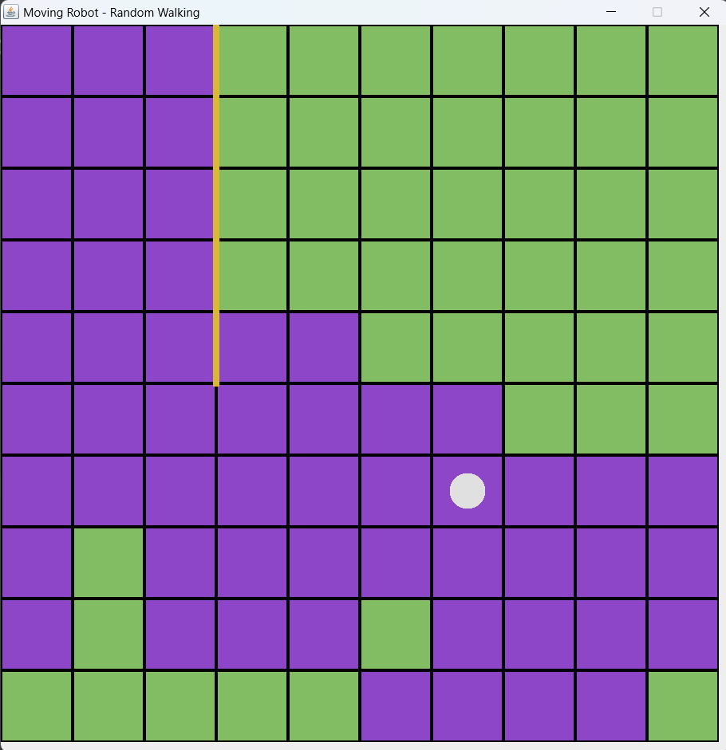

# Moving Robot
API to code custom robot behavior.
<br>
I got a task on my IT lesson to code a robot that moves on a certain path near the walls and paint cells. I so disliked program we were using in school, so I coded this engine to play with robots and algorithms! :3

***

# Main Classes and Definitions

### Board
<ins>Board</ins> is a space where robot can move.
<br>
It has 2 parameters: `width` and `height`
<br>
* `width (int)` is an amount of cells on the board by width.
* `height (int)` is an amount of cells on the board by height

### Robot
<ins>Robot</ins> is machine that executes commands (move and paint for now).
<br>
It has 4 parameters: `spawnX`, `spawnY`, `algorithm` and `delay`
<br>
* `spawnX (int)` and `spawnY (int)` are coordinates of robot in the 1st tick of simulation
* `delay (int)` is amount of ticks to execute 1 command
* `algorithm (Class extends IRobotAlgorithm)` is a robot's behavior *(see Algorithms)*

### Walls
<ins>Walls</ins> are barriers through which robot can't move.
<br>
To create wall call `Board#wall(cellX, cellY, side)`
* `cellX (int)` and `cellY (int)` are coordinates of the cell that need to be surrounded by a wall
* `side (int)` is a side of the cell where it should have a wall

### Directions
Program works with 4 directions, represented by integers in the `Board` class:
* `UP = 1`
* `RIGHT = 2`
* `DOWN = 3`
* `LEFT = 4`

### Algorithms
<ins>Algorithm</ins> is a program that controls the robot. 
<br>
In the simulation the `IRobotAlgorithm#step` represents 1 step of robot's behavior, and it is called every tick of the simulation. It returns `boolean` value, the state of the simulation, if it is `false`, then simulation stops.

Example of step-function in `WalkRandomly` algorithm:
```java
@Override
public boolean step(Robot robot) {
    step++;
    robot.paint();
    int dir = random.nextInt(4) + 1;
    robot.moveTo(dir);
    return step < maxSteps;
}
```

***

## Starting a Simulation

1. Create `Main.java` in `src/com/cicdez/movingrobot/` or `<...>/movingrobot/client`
2. Implement main-function into it
3. Call `MovingRobotGame#create` and pass parameters for it
4. Call `MovingRobotGame#start` to run a simulation

`MovingRobotGame#create(boardWidth, boardHeight, robotX, robotY, wallGenerator, algorithm, robotDelay)`:
* `boardWidth (int)` and `boardHeight (int)` are width and height of the board *(see Board)*
* `robotX (int)` and `robotY (int)` are coordinates of robot int the 1st tick of a simulation *(see Robot)*
* `wallGenerator (Consumer<Board>)` is a lambda method to generate walls on the board *(see Walls)*
* `algorithm (Class extends IRobotAlgorithm)` is a class with code for robot's algorithm *(see Robot)*
* `robotDelay (int)` is a delay between robot's steps *(see Robot)*

```java
import com.cicdez.movingrobot.MovingRobotGame;
import com.cicdez.movingrobot.algorithms.*;

import static com.cicdez.movingrobot.Board.*;

public class Main {
    public static void main(String[] args) {
        //Creating game
        MovingRobotGame game = MovingRobotGame.create(
                10, 10,  //Board size
                0, 0,  //Robot spawn
                
                //Walls generator
                board -> {
                    board.wall(2, 0, RIGHT);
                    board.wall(2, 1, RIGHT);
                    board.wall(2, 2, RIGHT);
                    board.wall(2, 3, RIGHT);
                    board.wall(2, 4, RIGHT);
                },
                
                //Algorithm
                new WalkRandomly(1000, 0),
                
                0  //Delay
        );

        //Starting game
        game.start();
    }
}
```

***

# Images
Simulation from the code above

